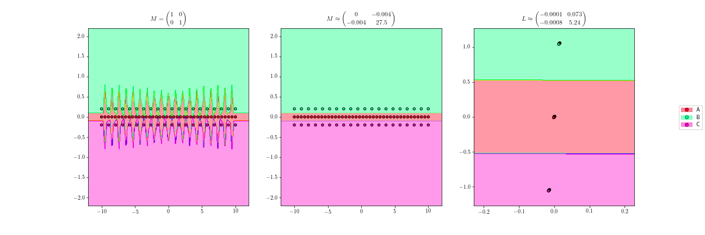

# rDML

Distance Metric Learning Algorithms for R. This library is a R wrapper for the Python [pyDML](https://github.com/jlsuarezdiaz/pyDML) package.

## What is Distance Metric Learning?

Many machine learning algorithms need a similarity measure to carry out their tasks. Usually, standard distances, like euclidean distance, are used to measure this similarity. Distance Metric Learning algorithms try to learn an optimal distance from the data.

## How to learn a distance?

There are two main ways to learn a distance in Distance Metric Learning:

- Learning a metric matrix M, that is, a positive semidefinite matrix. In this case, the distance is measured as

- Learning a linear map L. This map is also represented by a matrix, not necessarily definite or squared. Here, the distance between two elements is the euclidean distance after applying the transformation.

Every linear map defines a single metric (M = L'L), and two linear maps that define the same metric only differ in an isometry. So both approaches are equivalent.

## Some applications

### Improve distance based classifiers

*Improving 1-NN classification.*

### Dimensionality reduction

*Learning a projection onto a plane for the digits dataset (dimension 64).*

## Documentation

Watch the package documentation [here](https://jlsuarezdiaz.github.io/software/rDML/docs). For more details about the wrapped algorithms, see also the [pyDML's documentation](https://pydml.readthedocs.io).

## Installation

- From GitHub: from the R console, install the package `devtools`. Then, run the command `devtools::install_github("jlsuarezdiaz/rDML")`.

## Authors

- Juan Luis Suárez Díaz ([jlsuarezdiaz](https://github.com/jlsuarezdiaz))
